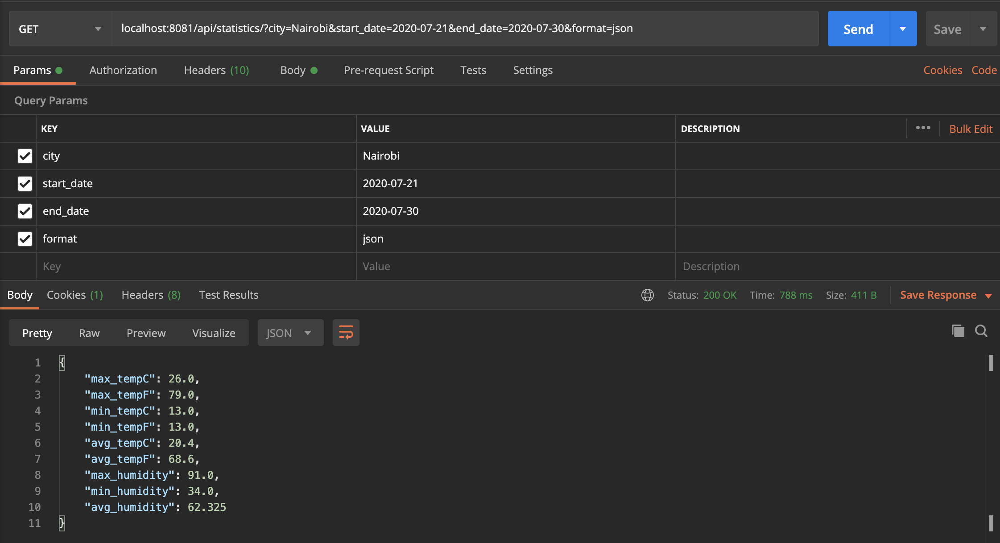

# Weather-API
An API that fetches weather data for a location for a specific period of time

## Technologies Used
1. Python 3.x
2. Django
3. Django Restframework
4. Pandas
5. Numpy
6. Requests Library

## Setup
Clone the repository

```
$ git clone https://github.com/wycliffkas/Weather-API.git
```

Change directory to the project folder

```
$ cd Weather-API
```

Create and activate Virtual environment. Here I used [Pipenv](https://pypi.org/project/pipenv/)

```
$ pip install pipenv
$ pipenv shell
```

Install Dependencies
```
$ pipenv install
```

# Running the project

To start the project, run the command

```
$ python managa.py runserver
```

Use Postman or Curl with the url http://localhost:8000/api/statistics/ and provide the following
parameters: city, start_date, and end_date as shown in  the screenshot below

